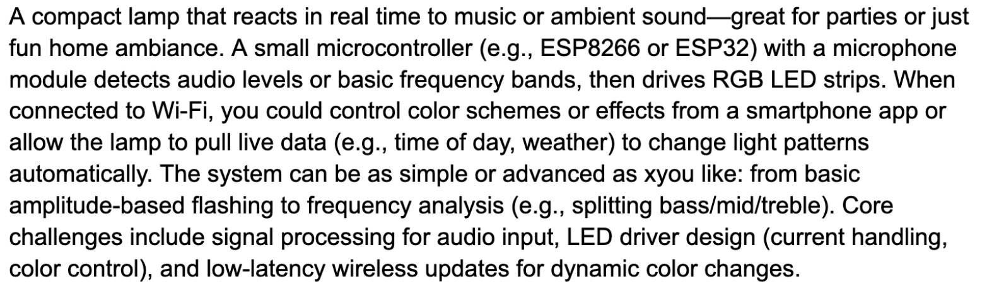
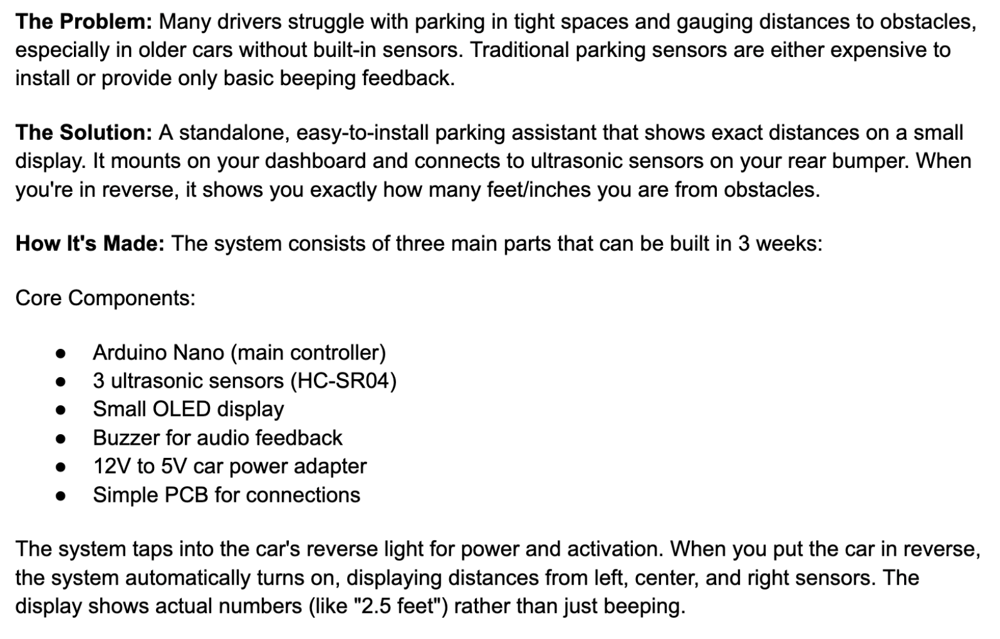
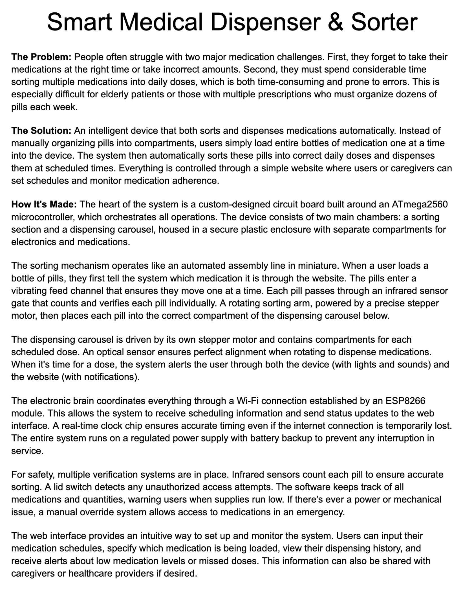

# Notebook 1

**Date:** January 25th, 2025

## Objectives
1. Find a project to work on
2. Perform market analysis on the project idea
3. Write up the RFA

## Record of Work

Idea 3: Smart Glasses for Visually Impaired

Problem: Visually impaired people can't tell where sounds come from in group settings.

Solution: Smart glasses that tell the wearer which direction a voice is coming from.

Key features:
1. Microphones on the glasses to detect sound direction
2. Vibration feedback on the side where sound comes from
3. Optional LEDs for those with some vision
4. Rechargeable battery in the frame

Benefits: Helps users face the person speaking, making social interactions easier.

