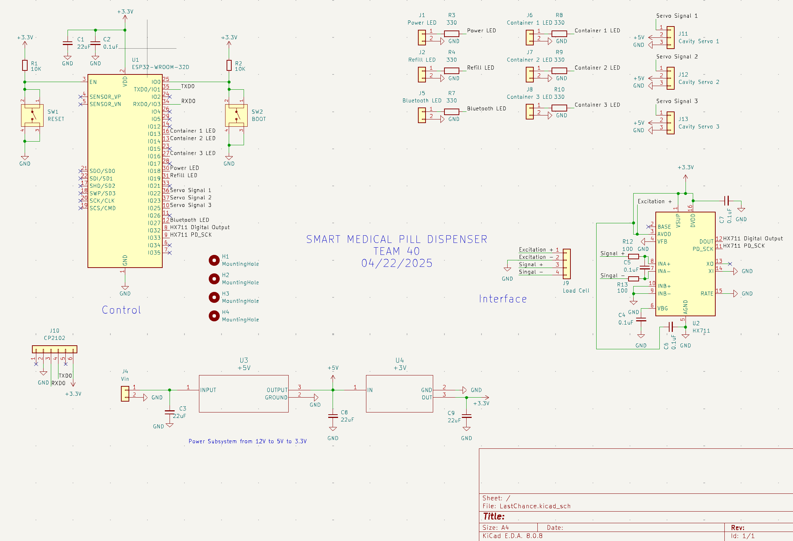
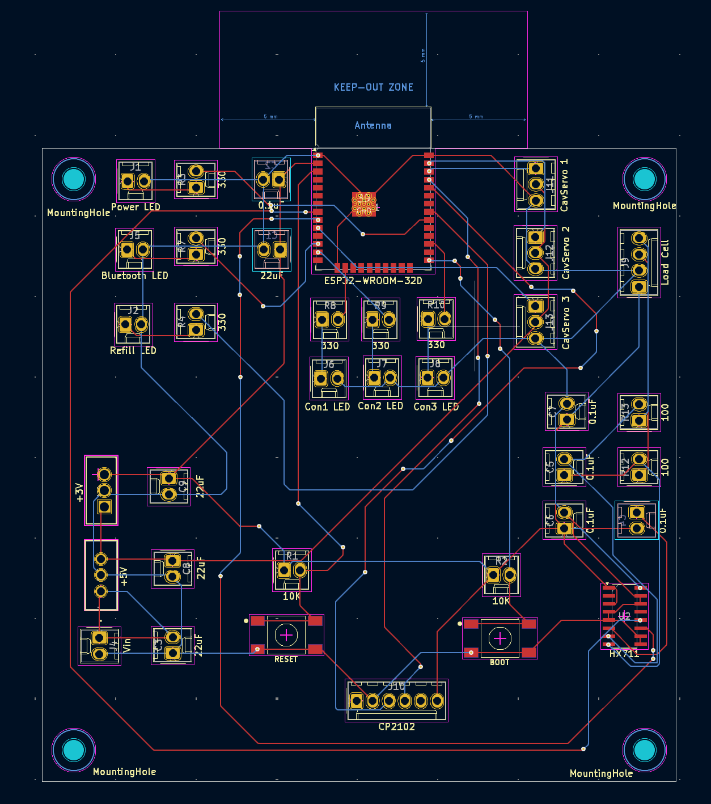
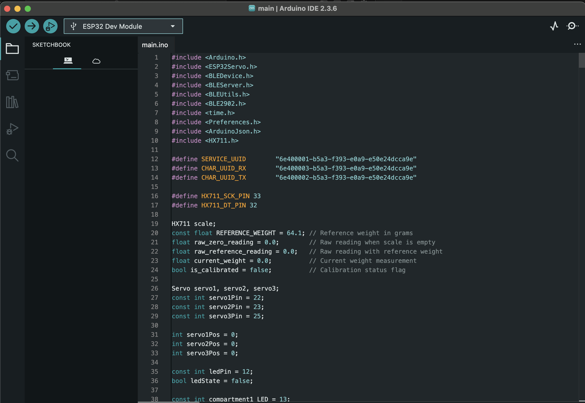
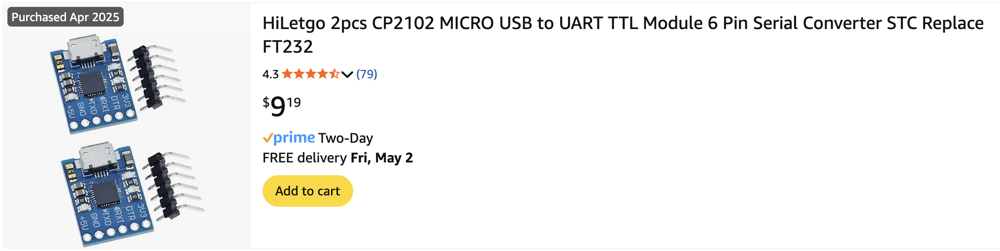
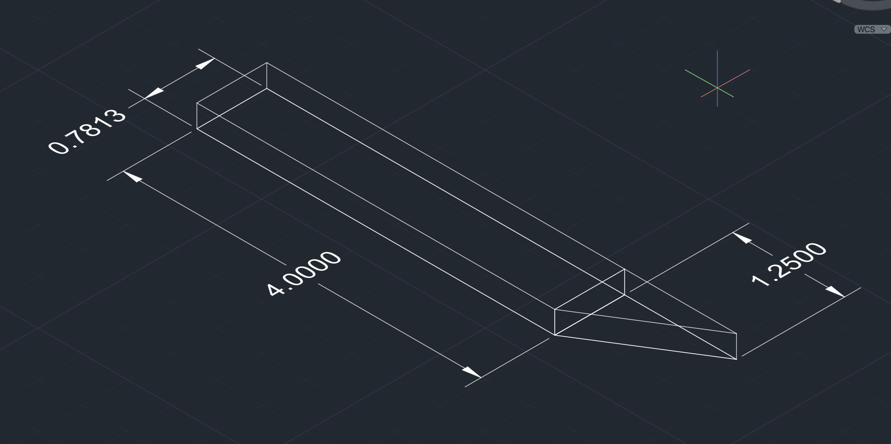
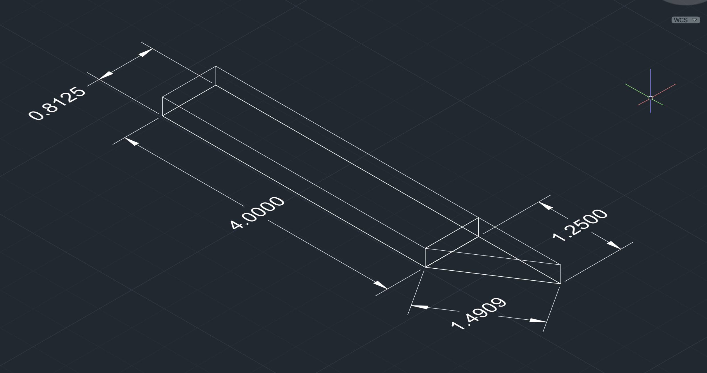
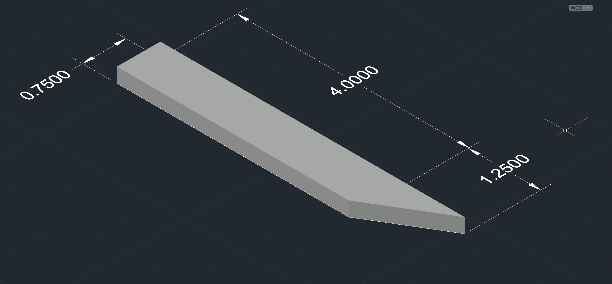

# Notebook 10

**Date:** April 20th, 2025

## Objectives
1. Power the Breadboard with the Power Only PCB
2. Create a Last Chance PCB with through holes only
3. Switch to programming with a breakout board
4. Implement 3D prints for compartment trimmers

## Record of Work

Created the "Last Chance" PCB and ordered it. Hopefully it comes in on time, this is our 6th and final PCB order likely. Used through holes only so when it does come we can solder it very quickly.

Need to buy solder paste still for the ESP32-WROOM-32D. I don't remember if I wrote in why we switched to 32D from 32U but it was because it had an antenna and only costed a few more cents.

### Last Chance Schematic View

### Last Chance PCB View

The arduino code is having some issues with dispensing on time when the scheduled medications pop up. The microcontroller can take commands pretty quickly but it does them one at a time. Maybe it is having issues because we are sending so many commands at once. Right now we have about 1,400 lines of code in our Arduino IDE, I think I can drop that to 900 though and clean up / refactor the code a ton.

### Arduino Code

The USB-UART breakout board should help a ton. We broke so many Micro USB ports because of poor soldering or didn't have the FT232RL soldered properly.

### CP2102 Breakout Board

Learned AutoCAD for this class. This trimmers should come in soon, will go to SCD and have them printed out. They said it should only cost about $1.80.

### 3D Prints

## Personal Thoughts
The power only PCB is working correctly outputting around 5.07V and 3.301V respectively. Tried to put power in directly to the output pins of the regulator through holes of the original PCB but that ended up leading to 1.7V for the 5V through hole or 0.6V for the 3.3V through hole. Going to need to figure out a way to power the final design with this PCB. That seems to be having the power subsystem on the PCB and the rest outside it. Hopefully we get a good set of points from the final demo rubric, and the final last chance PCB can come in time.

