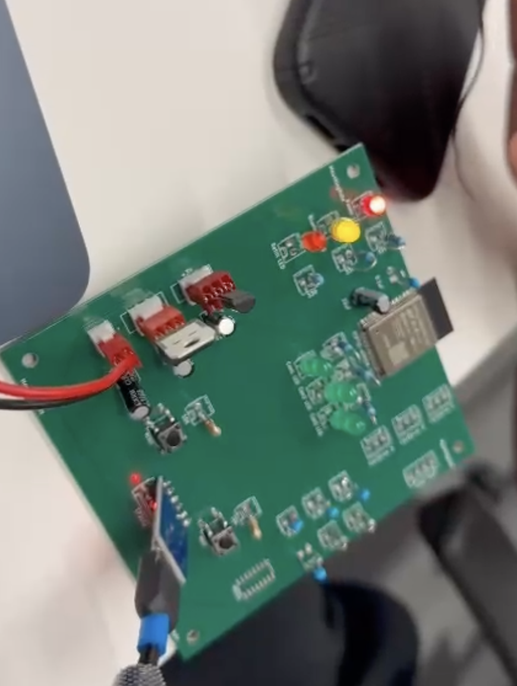
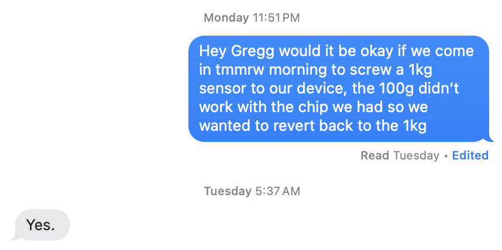
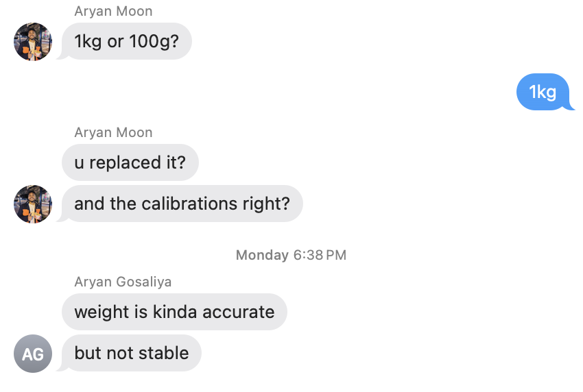
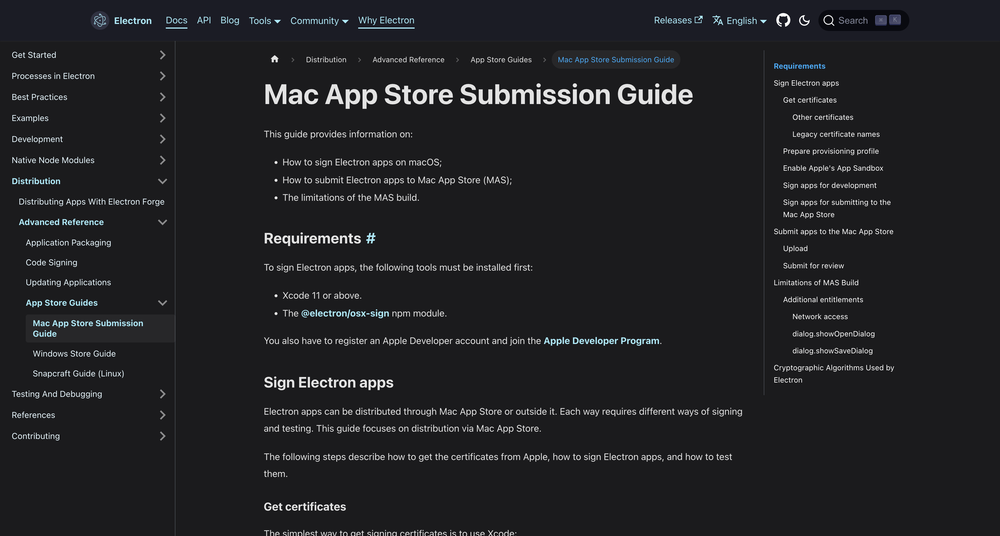

# Notebook 11

**Date:** April 27th, 2025

## Objectives
1. Solder the Last Chance PCB
2. Switch 100g sensor to 1kg sensor
3. Calibrate the 1kg sensor
4. Deploy app to App Store

## Record of Work

### Last Chance PCB Results
WE GOT THE PCB TO WORK. We were able to program a simple program making the light blink for bluetooth and the power light stay on the whole time. 

CP2102 breakout board was soldered weirdly so its throwing some errors if its not placed properly, but that's fine, all that matters is that it works.

Had to stay with the dev board for the final demo though because we ran out of HX711 ICs, going to buy more and see if we can still have this working by the end,

### Switching from 100g Load sensor to 1kg
Going to ask Gregg to let us swap the load sensor as soon as possible. Tried to do it myself but the screws aren't long enough to reuse the 100g's on the 1kg's. 

Had to swap the 100g for the 1kg because the HX711 can't reliably read the data from the 100g even with 80ms readings. It needs to use something like the AD7794 as an amplifier.

### Calibrating the 1kg load sensor
Calibrating the 1kg load sensor is taking a bit of time. We soldered it properly and the HX711 works well with it.

Was able to calibrate it with the Airpods Pro Gen 2 which weight 61.4g. It's reliably reading 61.2g over and over again.

### Deploying app to app store

Electron app is done but can't be deployed to app store because we aren't part of the apple developer program. Need to wait a few days and pay $99 so probably won't sign up for it. But, we do know it works.

## Personal Thoughts
Having to make A LOT of changes, kind of unsettling. We will likely need to use the dev board for the final demo. We do know what we would do to fix the PCB though, so hopefully that counts for something. Definitely learned a lot about engineering set backs and unaccounted for errors that can arise.

