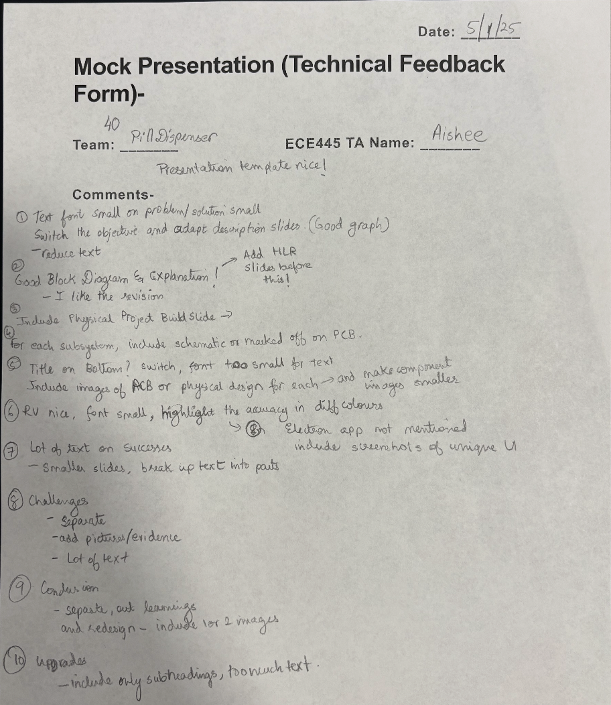
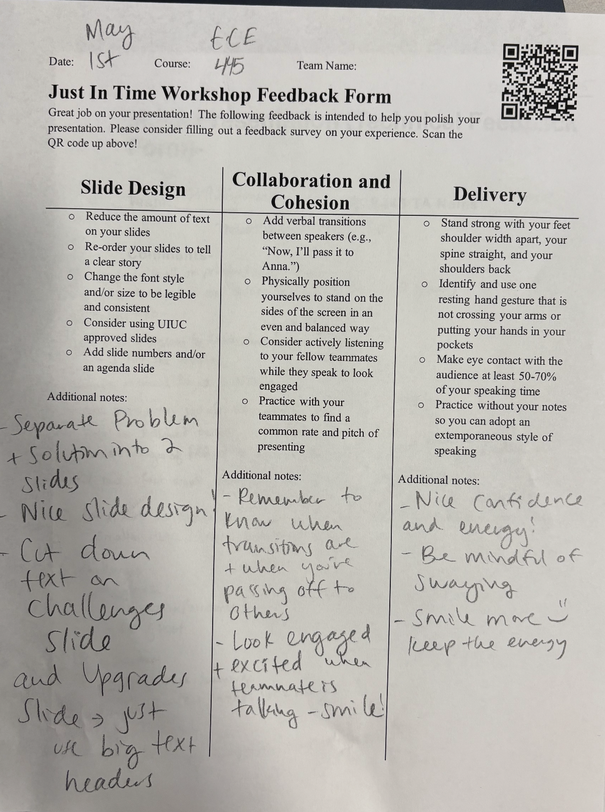
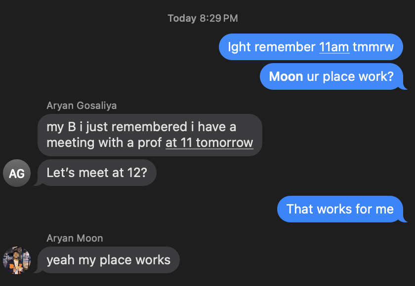
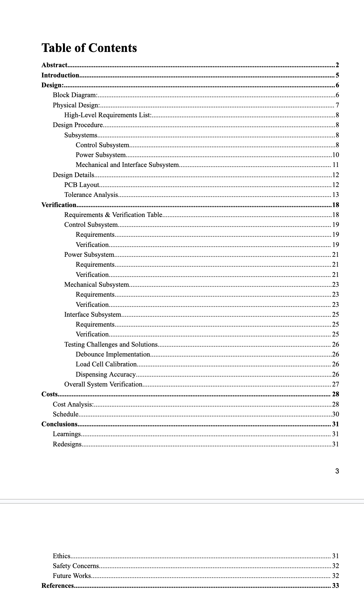

# Notebook 12

**Date:** May 4th, 2025

## Objectives
1. Finish Final Paper
2. Finish Final Presentation

## Record of Work
### Preparing for Mock Presentation

### Mock Presentation Notes

### Preparing for Final Presentation

### Final Paper Done

## Personal Thoughts
Final demo let us know that we didn't have the right R&V table set up. We need to make sure that we talk about HOW we got our tests done and set up a correct procedure for it. The final paper will have all of that and our presentation will too. Mock presentation gave us a lot of great insight into how to get the presentation to be better and improve our communication skills. Final paper is largely done and we also got the extra credit video completed. Going to finish the semester off strong.
