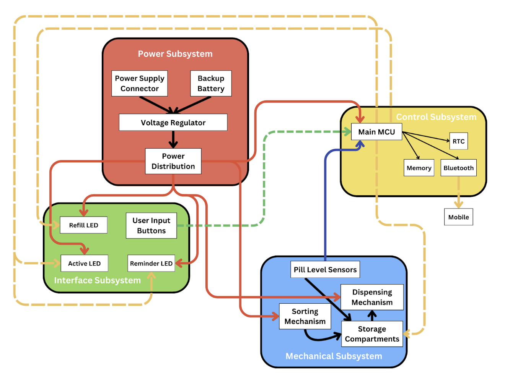
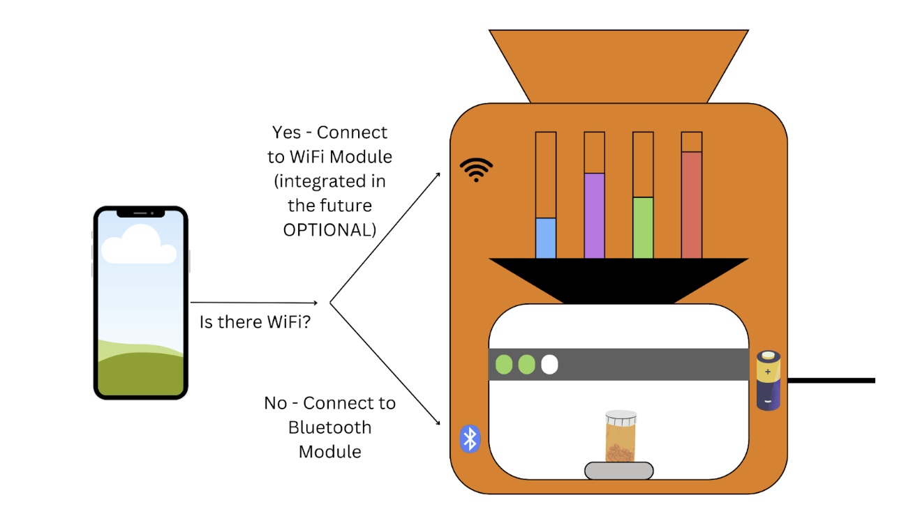

# Notebook 2

**Date:** February 8th, 2025

## Objectives
1. Determine the different subsystems required to build the project
2. Find similar products or subsystems already implemented to determine the different mechanical subsystems
3. Finalize a design for the solution and the general parts needed for that solution 

## Record of Work

### Subsystems

#### Subsystem 1
The RTC timekeeps when to dispense the medications according
to the schedule set by the user. It maintains accurate time even during power outages through its backup
battery system. The module communicates with the microcontroller to
provide current-time data.

#### Subsystem 2
The ESP8266 enables WiFi and remote management of the dispenser. It runs a web
server that hosts the UI for medication management and provides real-time status
updates. The module allows users to receive notifications. It processes HTTP requests
for schedule updates and transmits dispenser status data to the cloud.

#### Subsystem 3
The microcontroller drives the stepper motors that rotate the dispensing cylinder. It will
make sure that the pills were dispensed at the right time (aka did you take your
medication). The microcontroller activates buzzers or speakers for audible notifications
and LEDs for visual alerts when it is time to take medication. Using ESP8266, the
microcontroller connects to a web app to send reminders, allow remote monitoring, and
enable users to adjust schedules.

#### Subsystem 4
The weight sensor system uses load cells and an HX711 amplifier to measure
medication quantities. It monitors the weight of each medication compartment to track
pill counts and verify successful dispensing. The sensor data is used to detect when
medications are running low and trigger refill alerts.

#### Subsystem 5
The device housing and mechanical components are fabricated using food-safe PLA or
PETG filament. The design includes separate sealed compartments for each medication
type, a rotating dispensing mechanism, and channels for pill routing.

#### Subsystem 6
The top of the device will consist of a funnel-like structure which will enable the user to
dispense the pill bottles one at a time. The funnels will drop the pills into a jar to sort
them into different placeholders. Once one kind of pill has been emptied, there will be a
disk in place to rotate onto the next jar for the next pill to be dispensed into. To have the
pills dispense properly we will have the top of the funnel open and close when it is ready
to take in a new pill, additionally, it will rotate the pillars so that it is directly below the
funnel, so we never lose pills in any sense.

### Visual Aid

