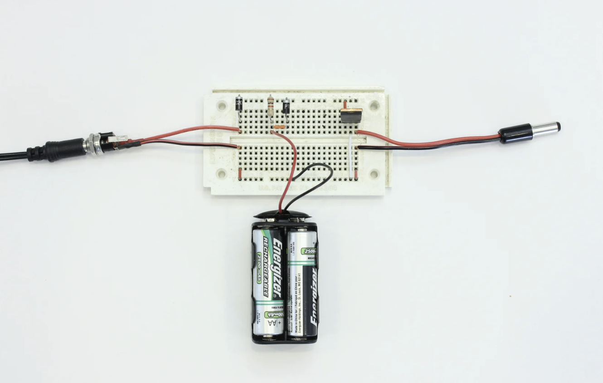
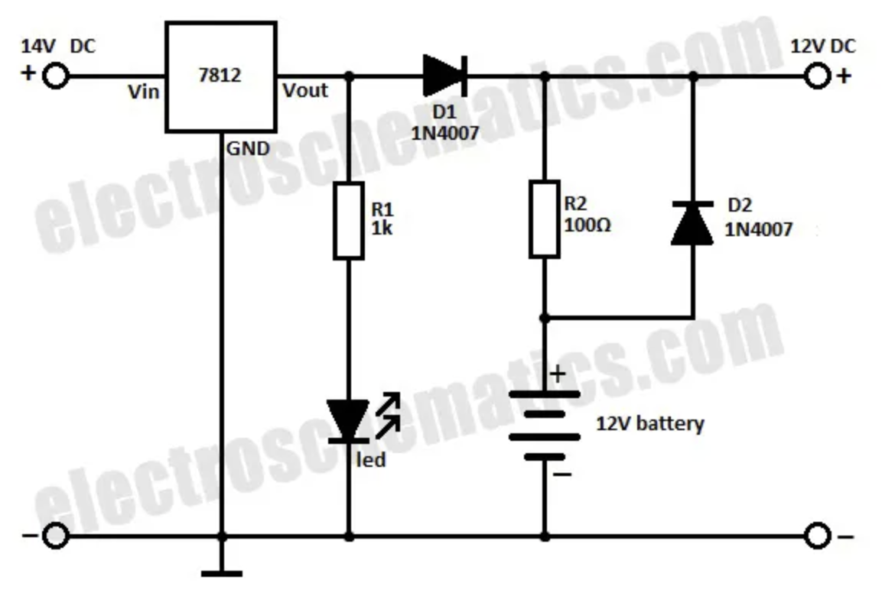
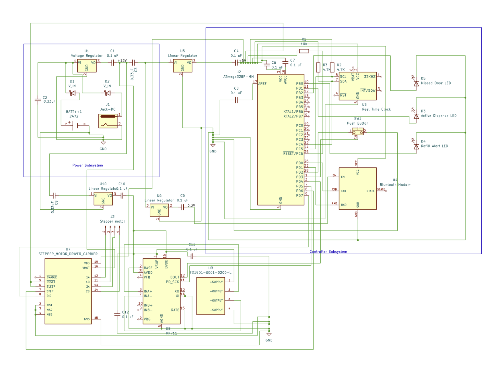

# Notebook 3

**Date:** February 15th, 2025

## Objectives
1. Finalize a design to take to the machine shop
2. Determine how to have both power jack and backup battery
3. Create an example circuit, to learn more about KiCAD

## Record of Work

## Personal Thoughts
First design on KiCAD is most certainly wrong. I just wanted to chalk something up just in case. The battery backup is worrying me, the battery would need to be rechargeable and just to charge it back up would be a whole 445 worthy project in itself. But, we need to figure out a solution to make this product work for the end user. I definately, need to go back and use labels for the circuit, it is awful otherwise. Also heavily considering removing ATmega and HC05 for ESP32.