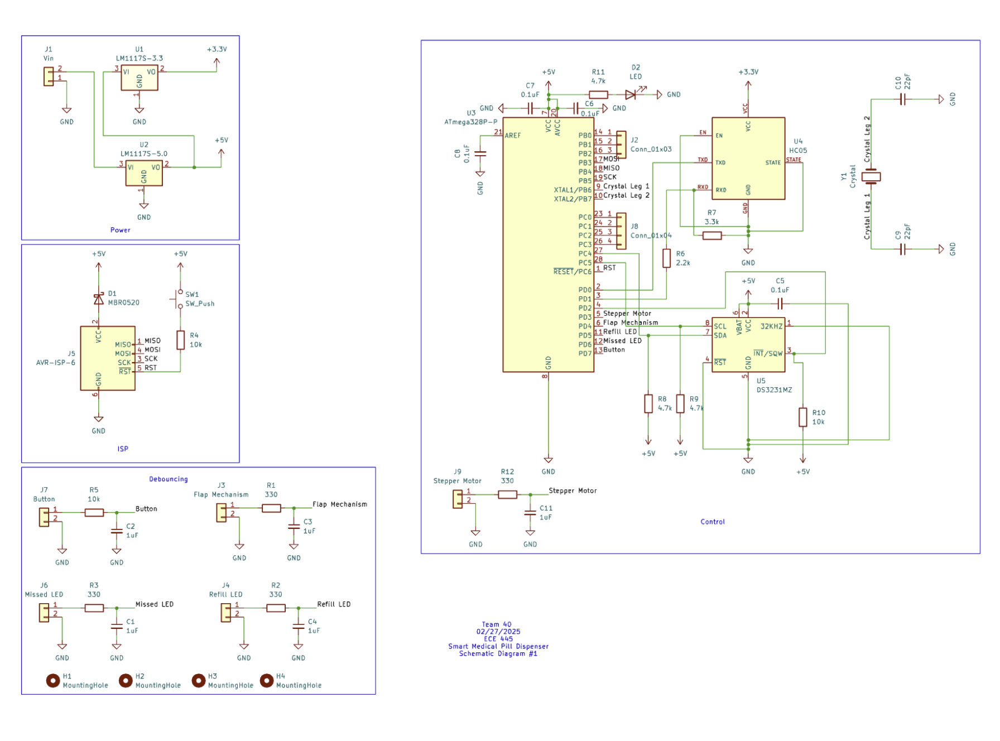
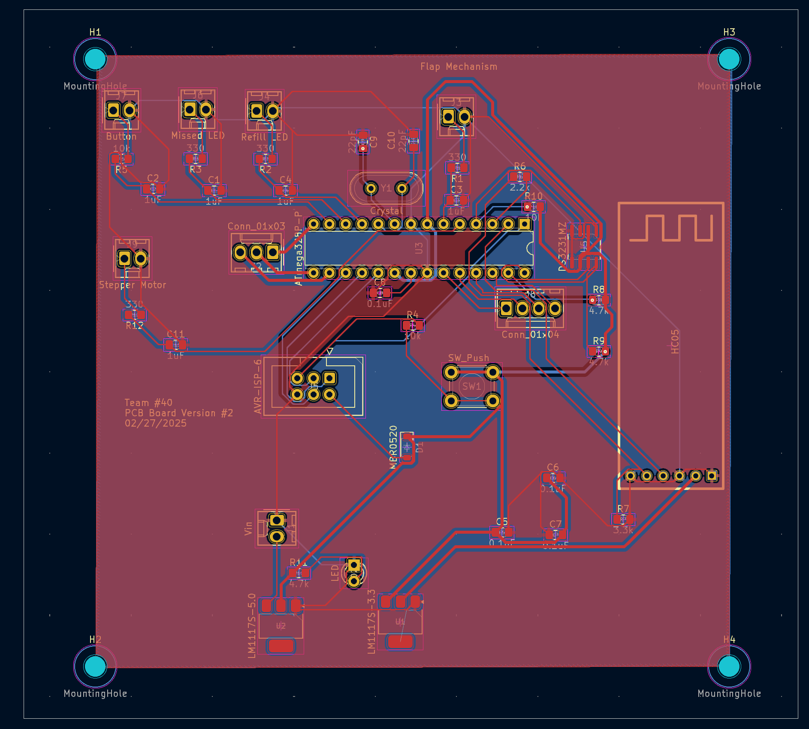
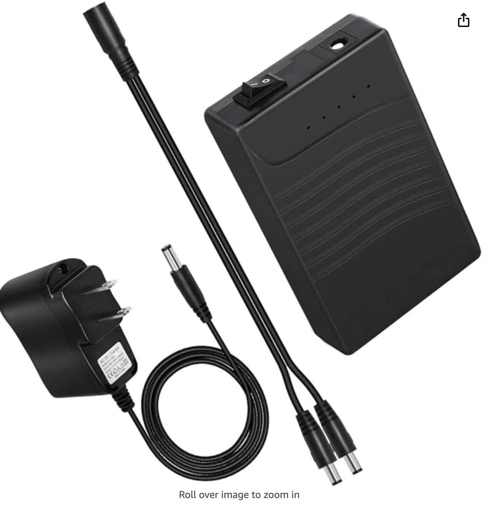
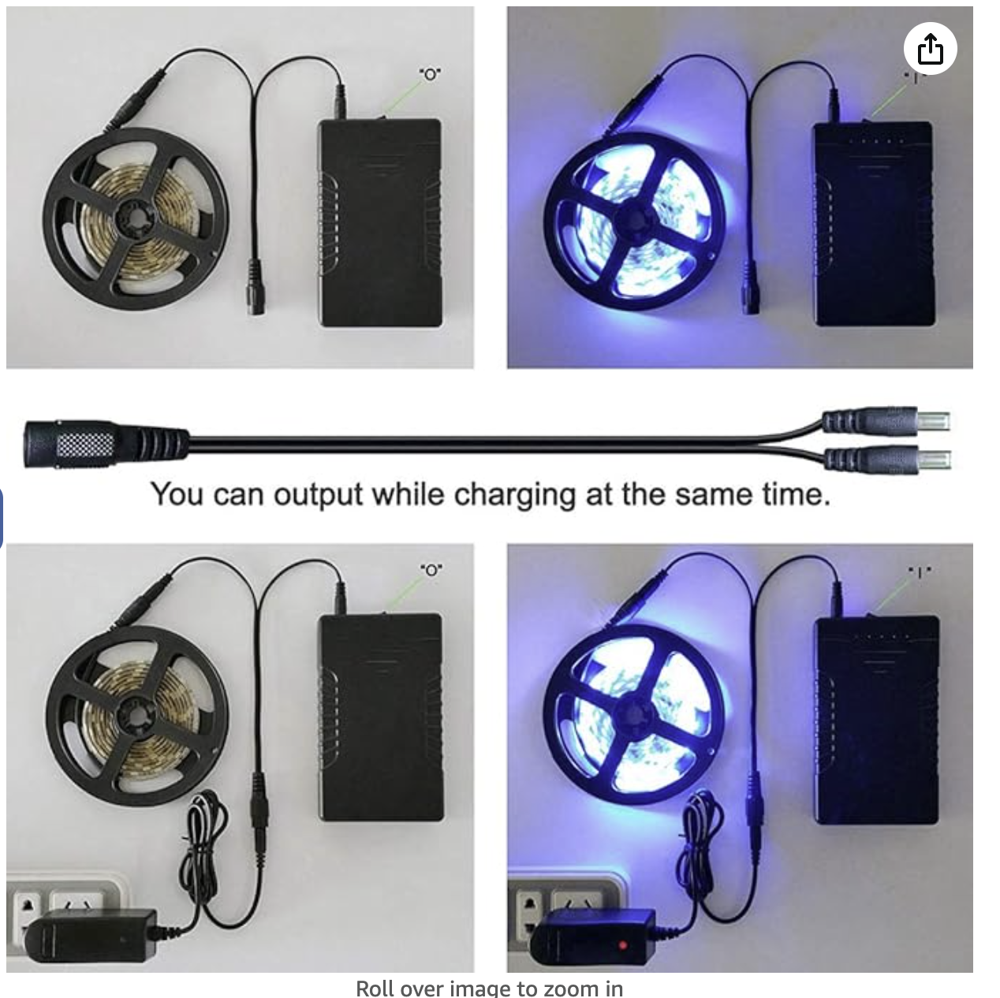

# Notebook 4

**Date:** February 25th, 2025

## Objectives
1. Create first PCB for PCB review
2. Find the exact parts needed
3. Determine which subsystems to demo for breadboard demo

## Record of Work

### TA Meeting Results for Demo:
1. Interface Subsystem (LEDs + Push button)
2. Power Subsystem (Backup battery + power jack)
3. Backup battery should charge up too
4. Mechanical Subsystem (servo motor / stepper motor)

### Battery To Buy

## Personal Thoughts
We are so behind. Correction. We WERE so behind. We didn't have our parts bought yet, nor ordered, we had to remake the whole PCB after the PCB review, and the battery backup still wasn't figured out. But this week and the weekend was the most productive ECE 445 week of our whole semester so far. We figured out the PCB luckily due to us practicing with KiCAD before hand. Using the self help drawers and supply center catalog we were able to switch our parts to easily available ones. We also found the battery backup wire on Amazon that reroutes and recharges for us. Lastly we were able to give our designs to the machine shop and actually get in queue (spot 36 but can be higher if we are first to give parts).