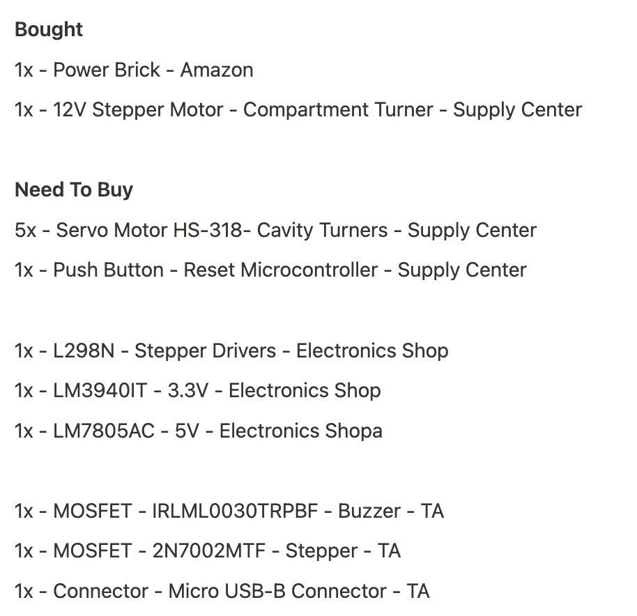
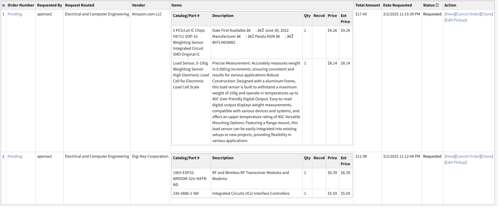

# Notebook 4

**Date:** March 1st, 2025

## Objectives
1. Change parts to those we can find in the supply center and electronics shop
2. Change microcontroller to ESP32-WROOM
3. Build the Schematic, PCB, and Gerber Files

## Record of Work

### Parts List

### PCBWay Order 1

