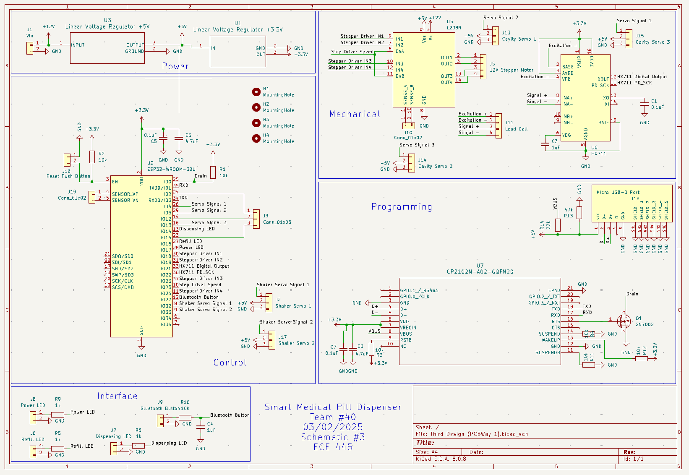
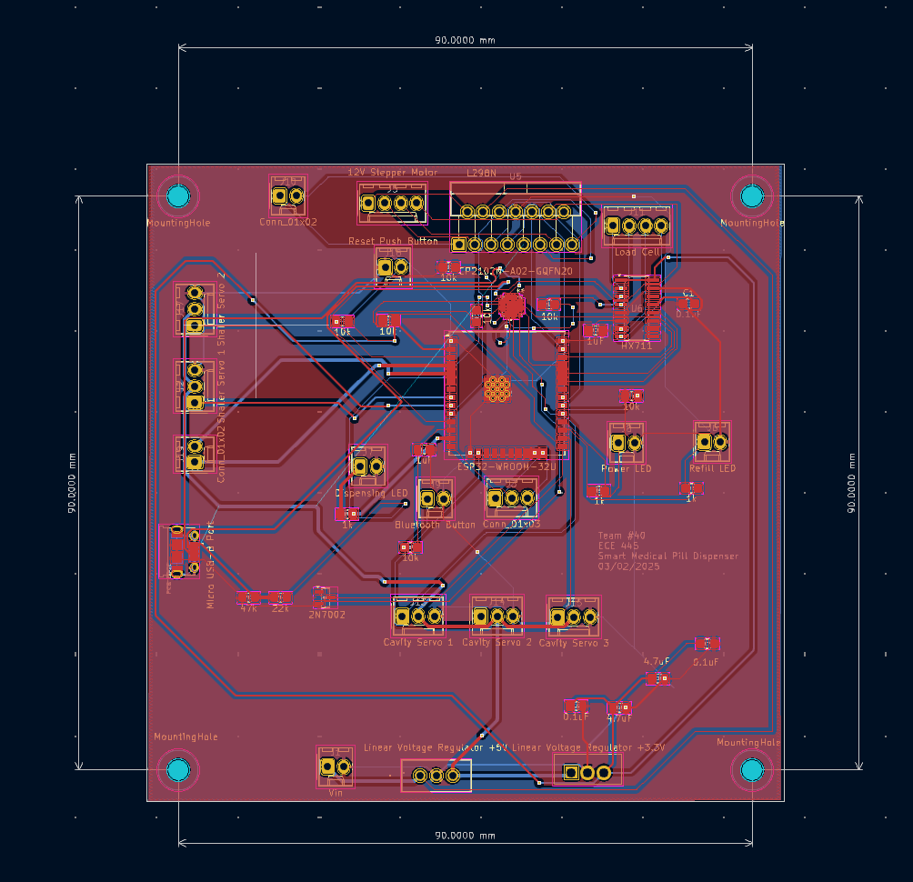

# Notebook 5

**Date:** March 1st, 2025

## Objectives
1. Change parts to those we can find in the supply center and electronics shop
2. Change microcontroller to ESP32-WROOM
3. Build the Schematic, PCB, and Gerber Files

## Record of Work

### Parts List

### PCBWay Order 1

## Personal Thoughts
Was able to buy and order the parts for the final demo. Was able to create the PCB for Order 1 in time, despite significant last minute changes. Honestly, just very relaxed right now. We need to make sure we stay up to date with the information the TA and the calendar has. CAN NOT fall behind again.