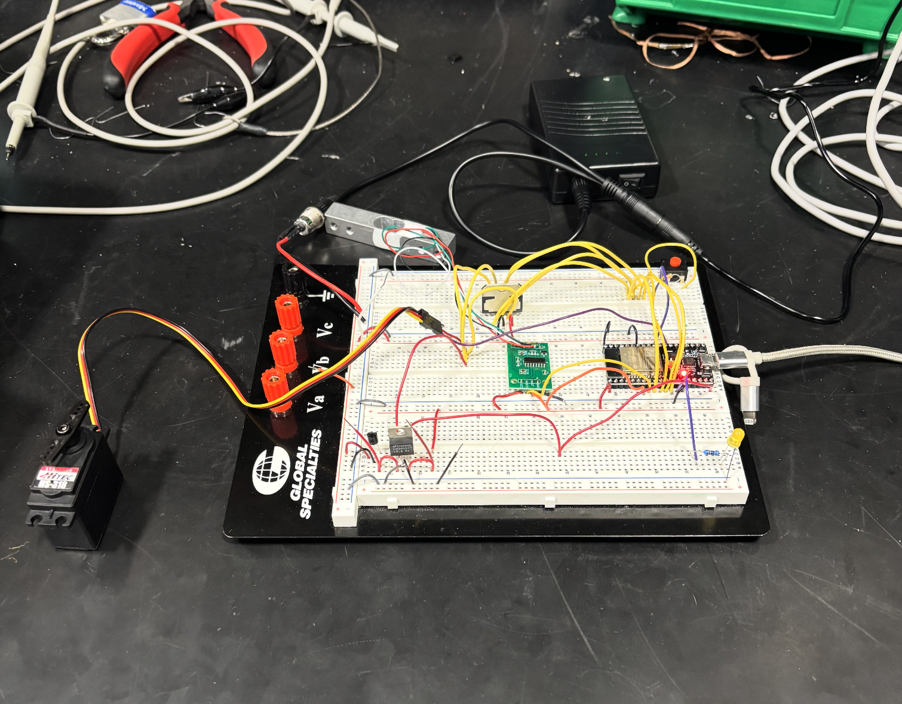
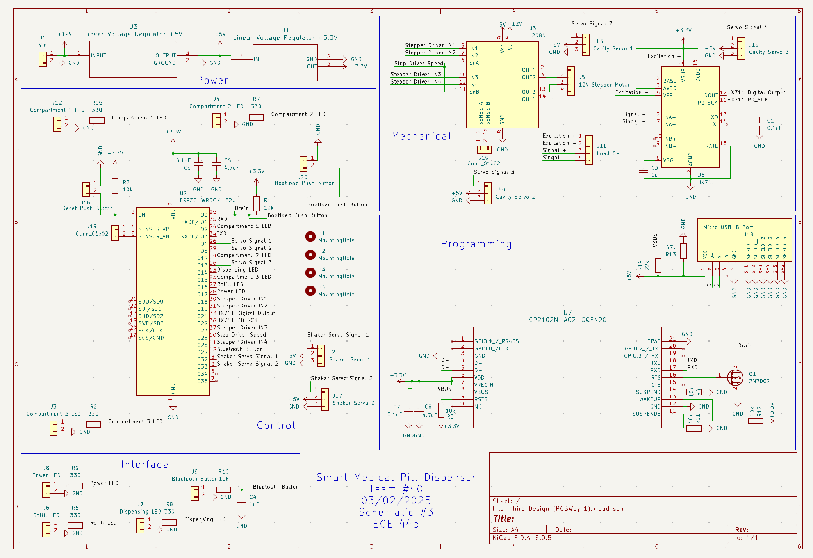
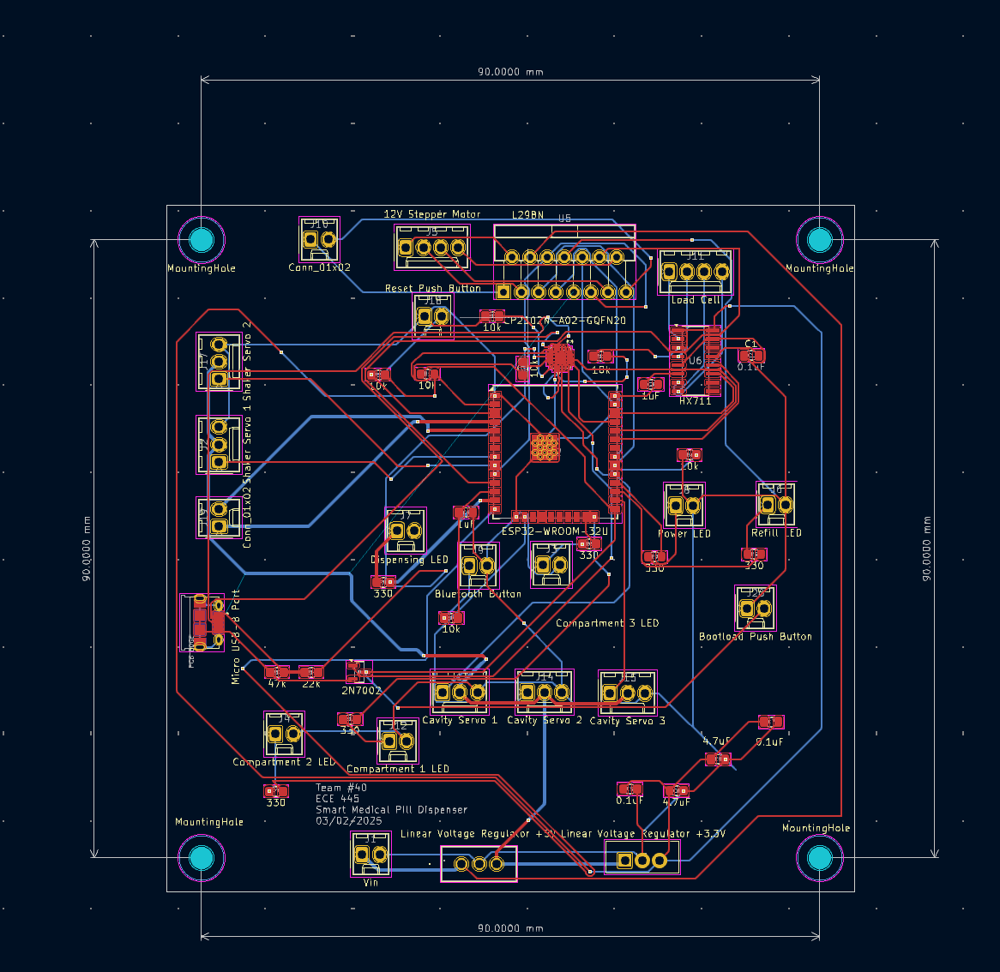

# Notebook 6

**Date:** March 5th, 2025

## Objectives
1. Complete Breadboard Demo Set Up
2. Create New PCB
3. Deliver Parts to Machine Shop

## Record of Work

We are second in line to have our machine built according to Gregg.

### Breadboard

### Second Round PCB
1. We need Reset and Boot buttons on the PCB
2. We need lower ohm resistors
3. We need to have the capacitors closer to the actual parts

## Personal Thoughts
Breadboard demo went really well. We were working on the button starting bluetooth pairing for the longest time. Most of our code and circuit will be scrapped, but just need to prove functionality, which we did. I think the Prof. liked it. Looking forward to 3D printing some parts after spring break and actually soldering the PCB from order 1. No big updates. Need to tweak schematic for PCB 2.