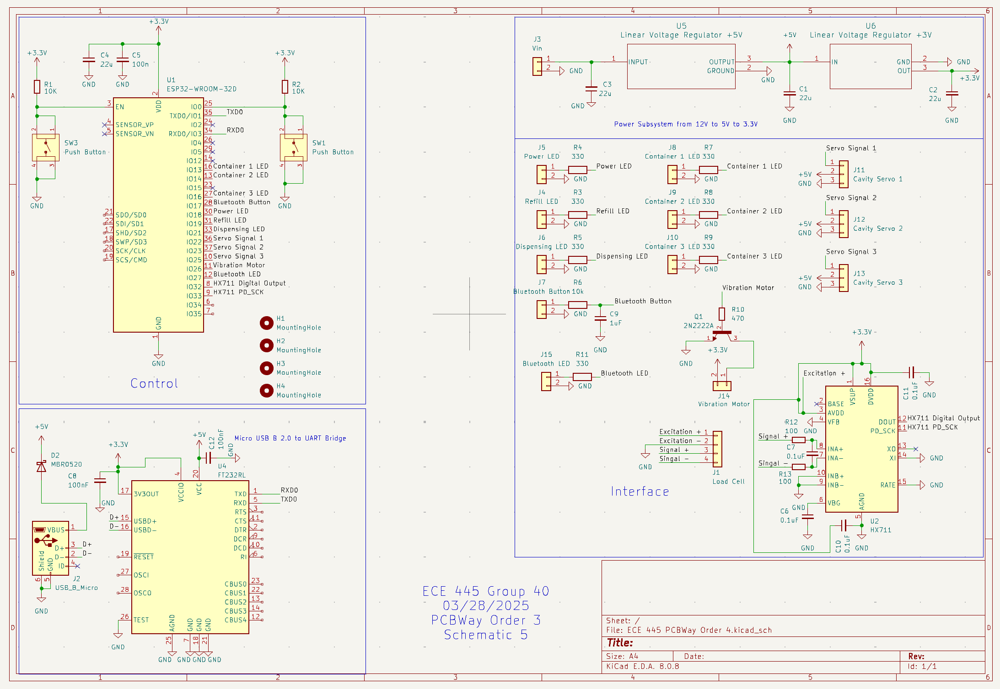
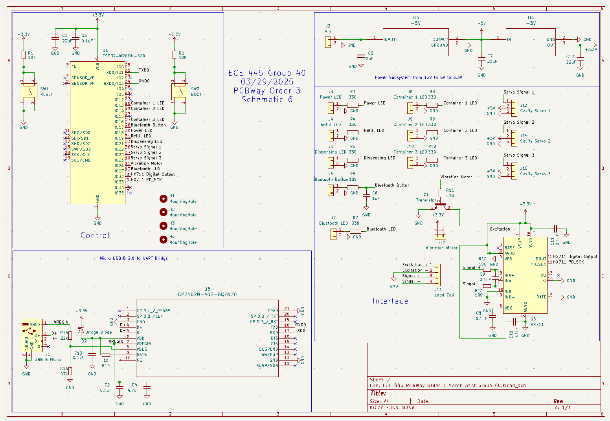
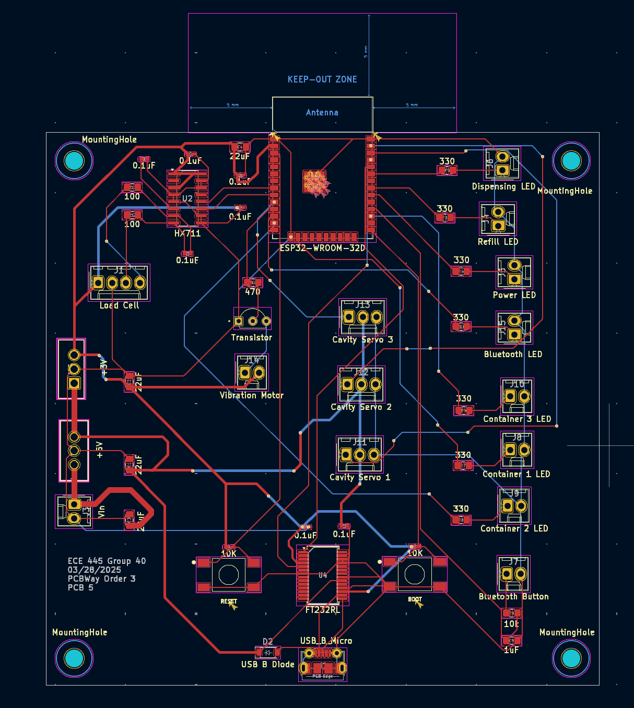
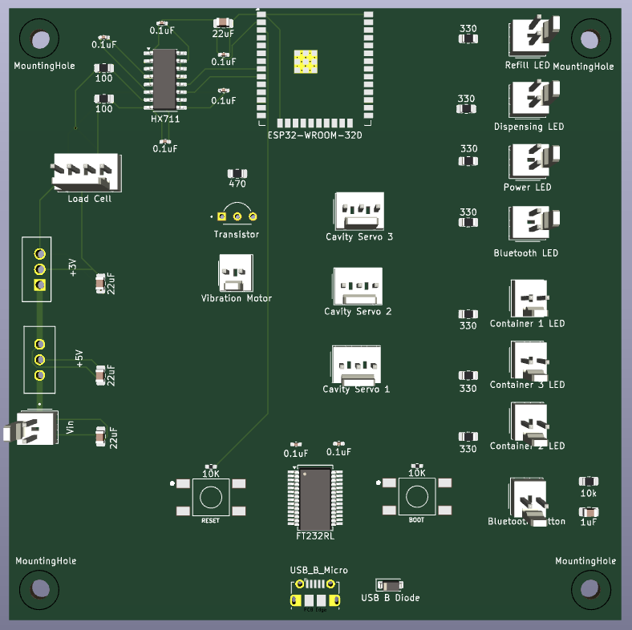
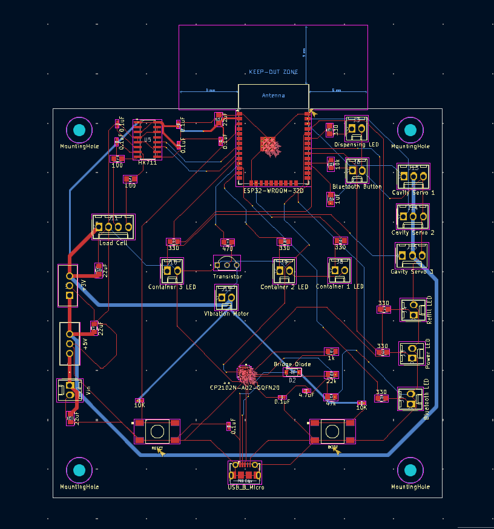
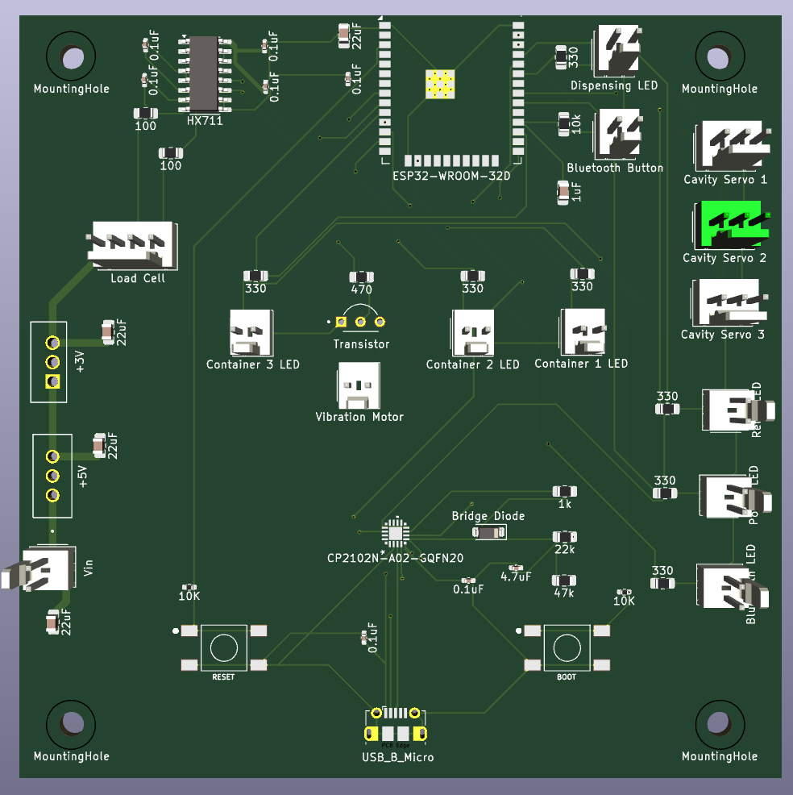

# Notebook 7

**Date:** March 29th, 2025

## Objectives
1. Complete PCB for CP2102 for Order 3
2. Complete PCB for FT232RL for Order 4
3. Order Extra Parts

## Record of Work
1. 2N2222A - Transistor - Self Help Drawers
2. MBR1100 - Schottky Diode - Self Help Drawers
3. CP2102 - Ordered 5
4. ESP32-WROOM-32D - Ordered 10
5. ESP32-WROOM-32U - Ordered 5

### Schematic

### PCB

## Personal Thoughts
Switched to a USB to UART bridge that we can get from self help drawers and easier to solder. Worried about finishing PCB on time, mainly due to delivery delays. Just ordered another round of PCBs on our own dime as well. Wiring and schematics make sense, so atleast we are going faster in that regard now.