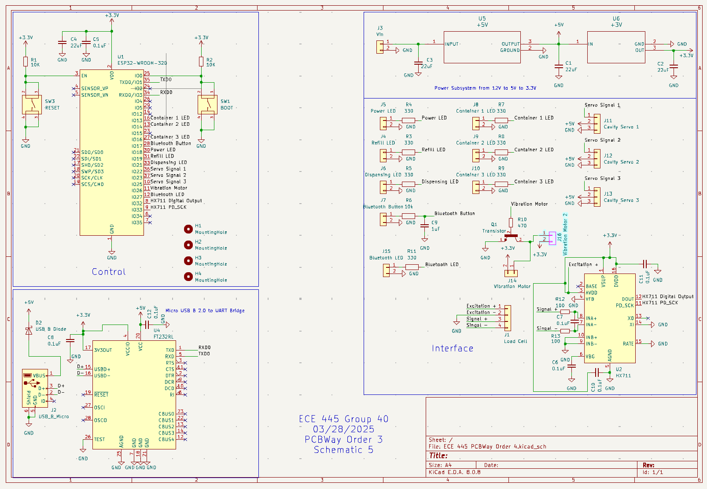
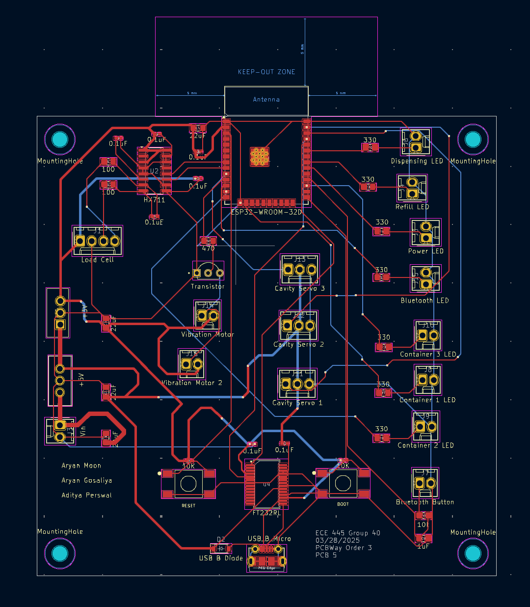

# Notebook 8

**Date:** April 6th, 2025

## Objectives
1. Complete PCB for FT232RL for ECE Order 4
2. Solder PCB3-Personal using Stencil

## Record of Work

Not a huge update this week. We have been soldering all our PCBs mostly this week but realized that we should probably fix some of the accidental 90 degree angles we created. Probably will run into issues and need to order another PCB though since we are behind in testing by a good margin.

### Schematic

Found the stencil so we can start using soldering paste. I also need to start using flux more often as it is a good way to keep the soldering clean.

### PCB

## Personal Thoughts
Soldering with stencil is A LOT EASIER. PCB-Personal being soldered this week, but exams are slowing us down. Programming the web app too, Aryan Gosaliya just made the finalized logic map. On track, looking like no longer ahead of schedule though.