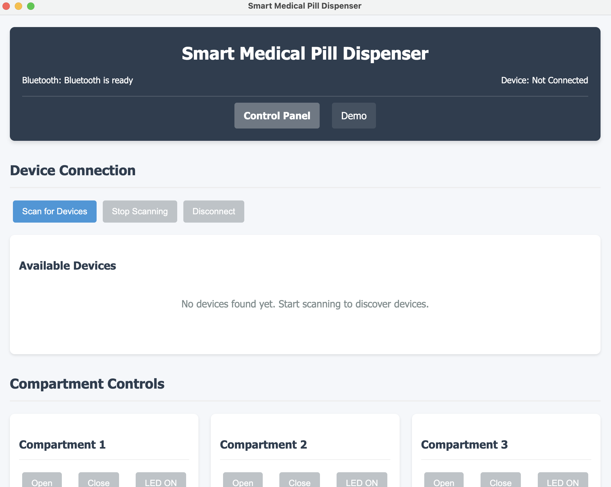
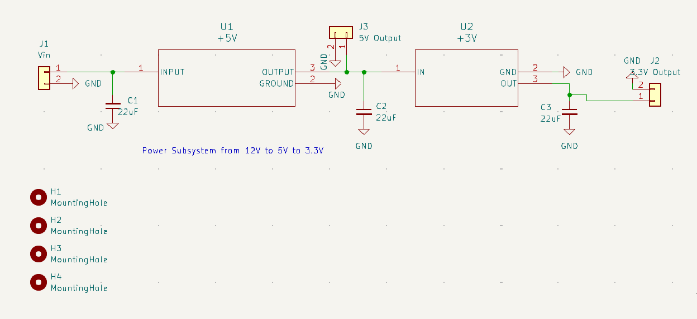
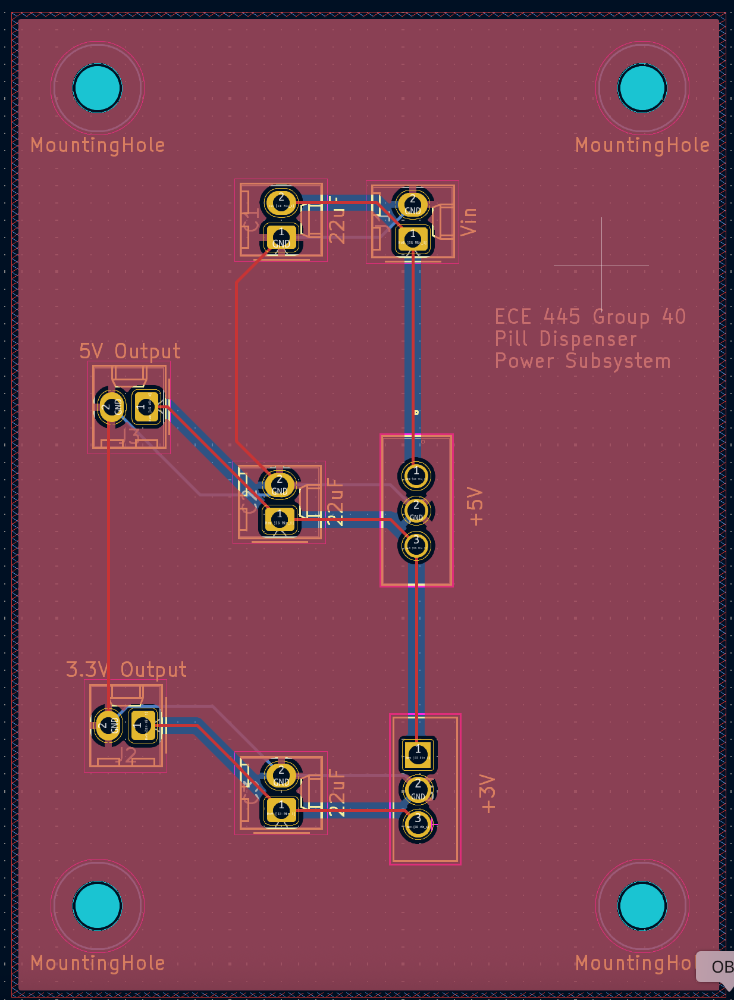

# Notebook 9

**Date:** April 13th, 2025

## Objectives
1. Get the Electron App to work
2. Get the Power Subsystem to work
3. Get new parts from the self help drawer
4. Figure out how to solder the diode since we dont have surface mounts
5. Figure out how to get the long pills to not jam or clog the cavity

## Record of Work

The 5V regulators are overheating so we switched to the L7805CV 5V Linear Regulator since it can handle up to 35V and can be attached to a heat sink.

The 3.3V Regulators don't seem to be working any longer, even on the breadboard. So we are going to try out the LP2950CZ. We don't know why none of the 3.3V linear regulators are working.

The Power Subsystem on the PCB when tested taking in 5V and 3.3V into what would be the output pins of the linear regulators, showed that the 5V dropped to 1.7V or the 3.3V dropped to 2V when both pins were having power sent in.

Our PCB's overheating because the trace widths are too large, most likely.

We are going to pull our power subsystem out into a seperate PCB to have it work

We ran out of FT232RL chips in the self help drawers, and don't have time to order more so we are switching back to CP2102 but its going to be hard to solder these on.

### Electron App

We added some neat things like LED animations, persistence of schedule in the ESP32 using bits for keeping schedule.
Pack schedule data into a 32-bit integer:
- Bits 0-5: ID (0-63)
- Bits 6-10: Hour (0-23)
- Bits 11-16: Minute (0-59)
- Bits 17-23: Days of week (bit field)
- Bit 24: Active flag

Going to solder the Power only PCB without surface mounts, with through hole instead.

### Power Only Schematic

### Power Only PCB

We tried soldering the diode but it keeps breaking, I wonder if we really need it for the time being, or if we can do without.

## Personal Thoughts

Having to make A LOT of changes, kind of unsettling. We will likely need to use the dev board for the final demo. We do know what we would do to fix the PCB though, so hopefully that counts for something. Definitely learned a lot about engineering set backs and unaccounted for errors that can arise. For the pills that are jamming we are going to decrease the size of the container, so that they can hold less but jam less too.
